# Class 11 on Humanoid Movement

## 1: Introduction and The Embodiment Gap

### 1.1 Defining the Core Problem

The fundamental challenge in transferring human motion to humanoid robots is the embodiment gap. Human subjects and target humanoids possess distinct topological and morphological differences, including variances in bone length, joint range of motion, kinematic structure, body shape, and mass distribution.

When driving humanoid motion, whether through offline datasets or real-time spatial computing streams (such as optical motion capture from iOS mobile devices), **direct joint-to-joint mapping fails**. It introduces critical artifacts like foot sliding, ground penetration, and physically impossible self-intersections. Overcoming this requires casting motion retargeting as an optimization problem governed by rigorous mathematical structures.

1. **Morphological Discrepancy (The Link Length Problem)**

    Even if a robot is designed to mimic human proportions, it is **almost never** an exact match. Humanoid robots have fixed mechanical link lengths $\mathbf{L}_{robot}$ that differ from the bone lengths $\mathbf{L}_{human}$ of any given human subject.

    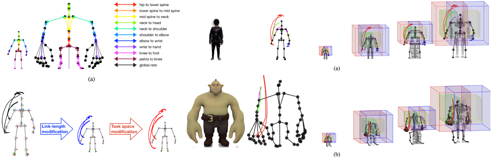
    
    Mathematically, the Cartesian position of an end-effector (like a foot or hand) is a function of both joint angles and link lengths: $\mathbf{x} = f(\mathbf{q}, \mathbf{L})$. Because $\mathbf{L}_{robot} \neq \mathbf{L}_{human}$, applying the same angles $\mathbf{q}_{human}$ results in a different spatial position:
    
    $$
    f(\mathbf{q}_{human}, \mathbf{L}_{robot}) \neq f(\mathbf{q}_{human}, \mathbf{L}_{human})
    $$

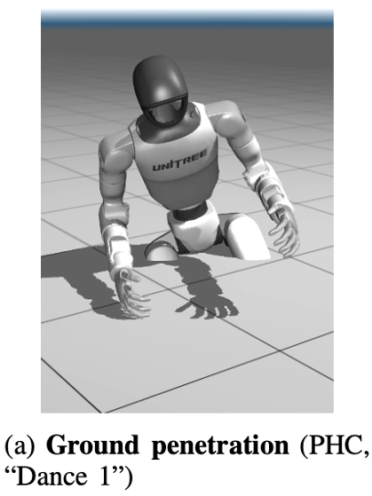

2. **Geometric Artifacts: Foot Sliding and Ground Penetration**


    The most visible failure of direct mapping occurs at the contact points.
    

    - **Ground Penetration**: If the human's thigh-to-calf ratio is larger than the robot's, a human "squat" angle might command the robot's feet to a position below the floor level.

    - **Foot Sliding**: Because the robot's legs are a different length, the distance the foot travels during a stride will not match the human's stride length. If the robot's global root (pelvis) moves at the human's velocity but its legs are shorter, the feet will appear to "skate" or slide across the floor to keep up, breaking the physical requirement of static friction during the stance phase.

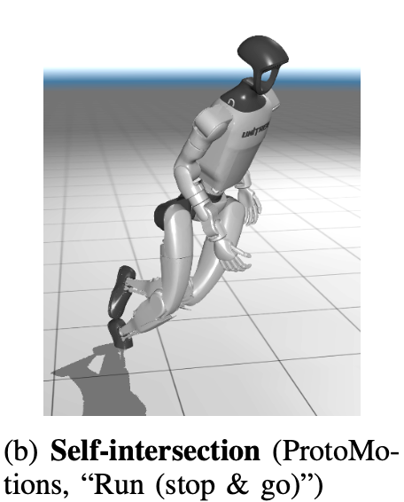

3. **Self-Collision and Workspace Incompatibility**

    Human joints and robot joints have different ranges of motion and physical volumes.

    - **Joint Limits**: A human may be able to reach a joint angle that exceeds the mechanical hard-stops of a robot's actuator. Direct mapping would result in commanded positions that the hardware cannot physically reach.

    - **Self-Penetration**: Human limbs are soft and compliant. Robotic limbs are often bulky, rigid housings for motors and electronics. A human pose where the hands are close to the chest might be perfectly safe for a person, but if those same angles are mapped to a robot with thick forearms and a protruding torso, the robot's arms will collide with its own chassis.

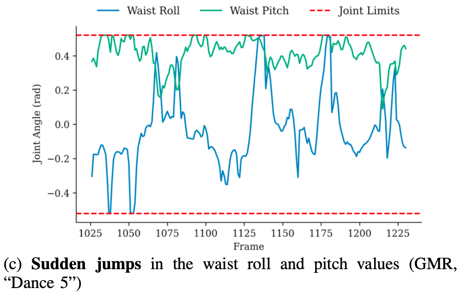

4. **Dynamic Instability**

    Direct mapping ignores the mass distribution and Center of Mass (CoM) of the robot. A human can maintain balance in a specific pose because their CoM is positioned over their support polygon. Because a robot has a different mass distribution (e.g., heavy motors in the hips or a battery in the torso), copying the human's joint angles will shift the robot's CoM to a different relative location, often causing the robot to tip over.

**The Latest Solution: Optimization-Based Retargeting**

Because direct mapping fails, researchers use Inverse Kinematics (IK) or General Motion Retargeting (GMR). Instead of copying angles, these systems treat the human data as "spatial suggestions." They define target positions for key body parts (the "key bodies") and then solve an optimization problem to find the specific $\mathbf{q}_{robot}$ that places the robot's hands and feet as close as possible to the human's targets while strictly enforcing the robot's joint limits, self-collision boundaries, and balance constraints.

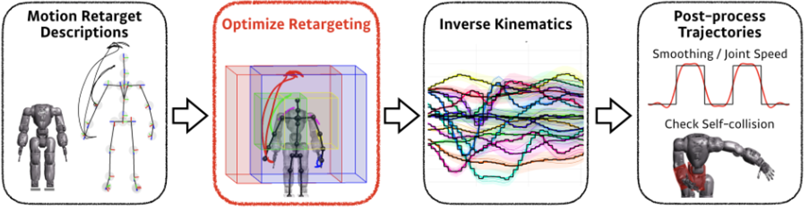

### 1.2 Contextualizing the Pipeline

Modern humanoid control relies on a three-tiered architecture:

1. **State Representation**: Modeling spatial movement on continuous transformation manifolds.
2. **Kinematic Optimization**: Abstracting variables and costs into modular, differentiable solvers.
3. **Applied Retargeting**: Scaling and projecting source human data onto the target robot's kinematic chain to generate artifact-free references for downstream hierarchical controllers or reinforcement learning (RL) policies.

## 2: Micro Lie Theory for Humanoid State Representation

- [A Micro Lie Theory for State Estimation in Robotics](https://arxiv.org/pdf/1812.01537)
    - Joan Sola, Jeremie Deray, Dinesh Atchuthan 

Humanoid movement does not occur in simple Euclidean space; it involves complex 3D rotations and translations. To handle uncertainties, derivatives, and integrals precisely, we rely on Lie theory.

- **Eliminate Gimbal Lock**: Ensuring reliability in all orientations.
- **Enable Correct Math**: Providing a consistent way to add, subtract, and differentiate poses.
- **Improve Optimization**: Allowing SLAM and IK solvers to operate on the "natural" geometry of 3D space.
- **Maintain Validity**: Ensuring that robot states always correspond to physically possible configurations.

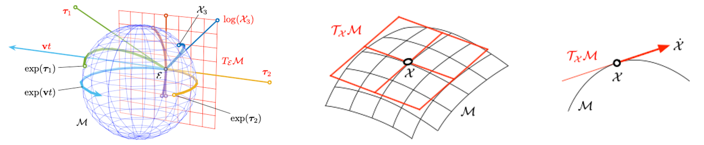


1. **Avoiding Topological Singularities ([Gimbal Lock](https://en.wikipedia.org/wiki/Gimbal_lock))**

    Most intuitive representations of rotation, such as Euler angles (roll, pitch, yaw), suffer from "singularities." When certain orientations are reached, the mapping between the representation and the actual physical rotation becomes non-unique, and the system loses a degree of freedom. This is known as **Gimbal Lock**.

    Lie groups treat rotations as elements on a smooth, continuous surface called a **manifold**. Because this representation is global and geometrically consistent, it never encounters these mathematical "dead zones," ensuring that control and estimation algorithms remain stable regardless of the robot's orientation.

2. **Principled Calculus: Integration and Differentiation**

    Robotics requires computing velocities (derivatives) and updating poses (integration). However, you cannot simply add two rotation matrices or two quaternions and expect the result to be a valid rotation.

    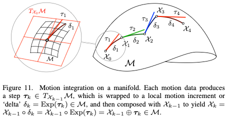 

    Lie groups provide a bridge between the "curved" manifold (the group) and a "flat" linear space called the Lie algebra (the tangent space).
    
    - **The Lie Algebra ($\mathfrak{so}(3)$ or $\mathfrak{se}(3)$)**: Represents small increments of motion (velocities).
    - **The Exponential Map**: A principled way to "wrap" a linear velocity vector onto the curved manifold to update a pose.
    
    This allows us to define the "plus" ($\oplus$) and "minus" ($\ominus$) operations correctly:
    
    $$
    \mathbf{X}_{new} = \mathbf{X} \oplus \boldsymbol{\tau} \triangleq \mathbf{X} \cdot \exp(\boldsymbol{\tau}^\wedge)
    $$
    
    This ensures that the updated state $\mathbf{X}_{new}$ is guaranteed to stay on the manifold (e.g., a rotation matrix remains orthogonal) without needing ad-hoc normalization.

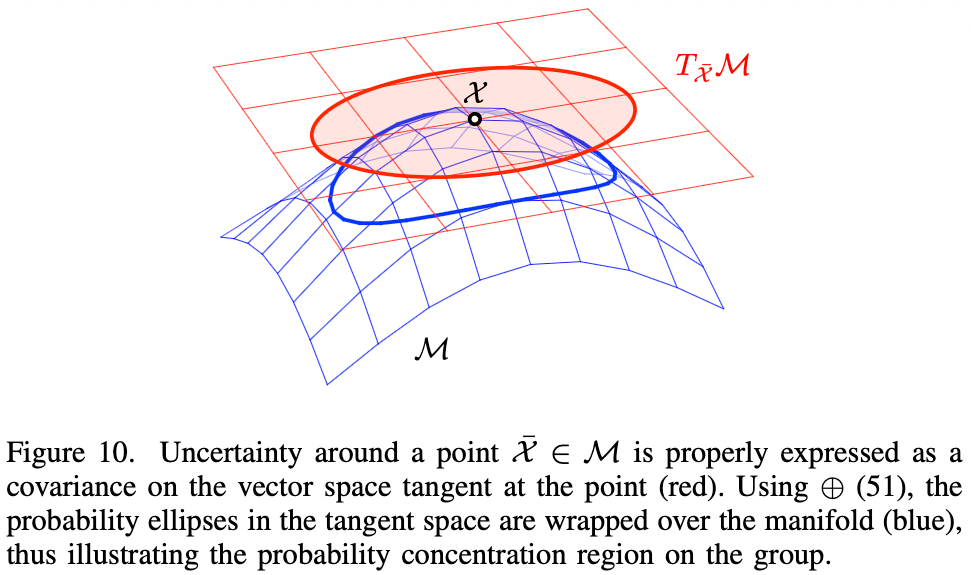 

3. **Consistency in State Estimation and Optimization**
    
    In tasks like SLAM (Simultaneous Localization and Mapping) or Inverse Kinematics, we often need to represent **uncertainty** or **solve least-squares optimization**.
    
    Standard Gaussian statistics assume data lives in a flat Euclidean space. Applying these directly to rotations leads to errors because the "mean" of rotations isn't just the average of their components. Lie groups allow us to define probability distributions and error functions directly in the tangent space (Lie algebra). This makes the optimization "geometry-aware," leading to faster convergence and higher accuracy in state estimation.

4. **Minimal yet Unconstrained Representation**
    
    While Quaternions are also common in robotics, they are "redundant" (4 numbers for 3 degrees of freedom) and require a unit-norm constraint. If a quaternion's magnitude drifts away from 1.0 during a simulation, it no longer represents a valid rotation.
    
    Lie groups allow us to work with minimal coordinates (3 numbers for rotation, 6 for full pose) in the Lie algebra for calculation, while maintaining the robust, constraint-free nature of the group during storage and composition.

### 2.1 Smooth Manifolds and Lie Groups

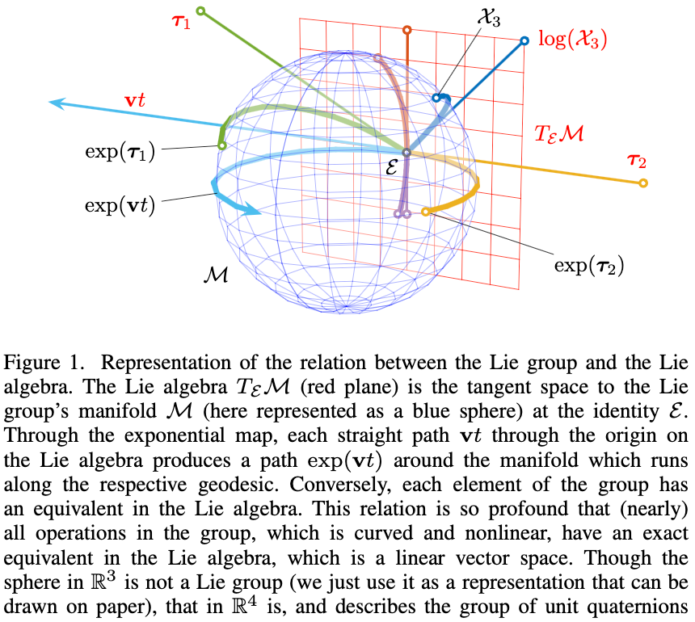 

A Lie group $\mathcal{G}$ is a smooth manifold whose elements satisfy the fundamental group axioms: closure under composition, identity $\mathcal{E}$, inverse, and associativity.

- **Rotations**: Modeled on $SO(3)$, the group of special orthogonal matrices.
- **Rigid Motions**: Modeled on $SE(3)$, combining rotations and translations into $4 \times 4$ transformation matrices.

The smoothness of the manifold ensures the existence of a unique tangent space at each point, which is a linear space where standard calculus applies.

### 2.2 Tangent Spaces and the Lie Algebra

The tangent space evaluated at the group's identity $\mathcal{E}$ is called the Lie algebra, denoted as $\mathfrak{m}$.

- **Mathematically**: $\mathfrak{m} \triangleq T_{\mathcal{E}}\mathcal{M}$.
- Elements of the Lie algebra are isomorphic to Cartesian vectors in $\mathbb{R}^{m}$, mapped via the linear operators $(\cdot)^{\wedge}$ (hat) and $(\cdot)^{\vee}$ (vee). For example, in $SO(3)$, a 3D angular velocity vector maps to a $3 \times 3$ skew-symmetric matrix.

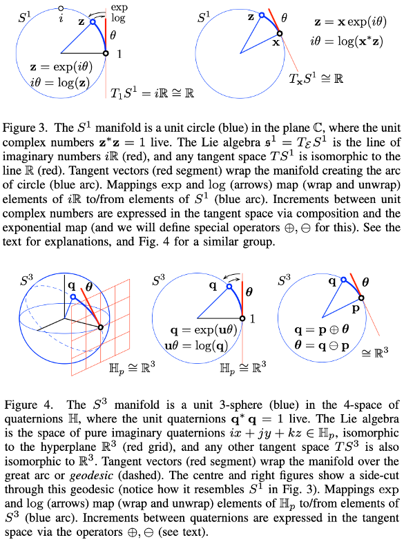 

### 2.3 Calculus on Manifolds and Uncertainty

To integrate motion or compute geometric errors, we map elements between the linear tangent space and the curved manifold:

- **Exponential Map ($exp$)**: Exactly converts elements of the Lie algebra into elements of the group, intuitively wrapping the tangent element along the manifold's geodesic.
- **Logarithmic Map ($log$)**: The inverse unwrapping operation.

To manipulate local tangent perturbations, we define the right-plus $\oplus$ and right-minus $\ominus$ operators:

$$
\mathcal{Y} = \mathcal{X} \oplus ^{\mathcal{X}}\tau \triangleq \mathcal{X} \circ Exp(^{\mathcal{X}}\tau) \in \mathcal{M}
$$

**Uncertainty Modeling**: State uncertainty is defined rigorously on the tangent space using the expectation operator:

$$
\Sigma_{\mathcal{X}} \triangleq \mathbb{E}[(\mathcal{X} \ominus \overline{\mathcal{X}})(\mathcal{X} \ominus \overline{\mathcal{X}})^{\top}]
$$

This allows us to construct mathematically sound Gaussian variables on manifolds, preventing the singularities (like gimbal lock) associated with Euler angles.

In the development and realization of the `mink` package, Lie Group theory serves as the primary mathematical engine that ensures geometric consistency, computational robustness, and singularity-free motion for differential inverse kinematics (IK).

## 3: Practical Differential IK with MuJoCo and `mink`

- [Mink: Python inverse kinematics based on MuJoCo](https://github.com/kevinzakka/mink)
    - Kevin Zakka

Translating modular costs into real-time environments requires highly efficient computational backends. The Python library `mink` serves as an industry-standard differential IK solver built explicitly on the MuJoCo physics engine.

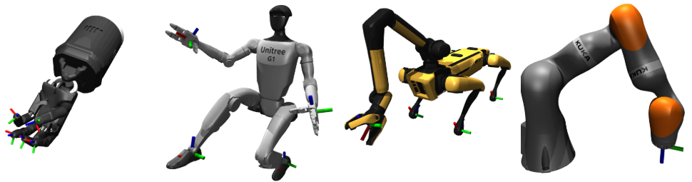

### 3.1. Rigorous State Representation on $SO(3)$ and $SE(3)$

Humanoid robots operate in 3D space, where orientations and rigid-body transformations do not live in a flat Euclidean space ($\mathbb{R}^n$) but on curved manifolds: the **Special Orthogonal Group** $SO(3)$ and the **Special Euclidean Group** $SE(3)$.

mink utilizes Lie Group theory to represent the robot's state $\mathbf{X}$ (such as the base pose or end-effector frames) natively on these manifolds. This approach avoids the topological singularities—specifically gimbal lock—inherent in Euler angle representations. By treating these states as group elements, the package ensures that any transformation composed with another remains a valid transformation (the closure property).

### 3.2. Differential Inverse Kinematics and the Lie Algebra

The "differential" aspect of mink refers to the mapping between velocities in the joint space (the configuration space) and velocities in the task space (the operational space).

In Lie theory, velocities are elements of the Lie algebra $\mathfrak{g}$ (the tangent space at the identity). mink computes the relationship between the joint velocity vector $\dot{\mathbf{q}}$ and the spatial velocity $\mathbf{v}$ using the geometric Jacobian $\mathbf{J}(\mathbf{q})$. The package implements the differential IK problem as a velocity-level optimization:

$$
\min_{\dot{\mathbf{q}}} \| \mathbf{J}(\mathbf{q})\dot{\mathbf{q}} - \mathbf{v}_{target} \|^2
$$

This ensures that the motion updates are computed in the local linear tangent space, where calculus is straightforward and numerically stable.

### 3.3. Implementation of the "Micro Lie Theory" Operators

mink explicitly references and implements the algorithmic framework proposed by Solà et al. (2018). The core of its optimization loop relies on the exponential map and the plus/minus operators:

- **Exponential Map ($\exp$)**: Used to "wrap" a computed velocity increment onto the manifold to update the robot's state without leaving the group.
- **The $\oplus$ (Plus) Operator**: Updates a pose $\mathbf{X}$ with a tangent perturbation $\boldsymbol{\tau}$: $\mathbf{X} \oplus \boldsymbol{\tau} = \mathbf{X} \cdot \exp(\boldsymbol{\tau}^\wedge)$.
- **The $\ominus$ (Minus) Operator**: Computes the geodesic distance (error) between two poses: $\mathbf{X}_2 \ominus \mathbf{X}_1 = \log(\mathbf{X}_1^{-1} \mathbf{X}_2)^\vee$.

By utilizing these operators, mink avoids the drift and inaccuracies associated with linearizing non-Euclidean spaces, allowing for high-precision tracking of spatial targets.

### 3.4. Adjoint Transformations for Collision Avoidance

For complex humanoid tasks, mink must handle constraints like collision avoidance between any pair of geometric primitives (geoms).

Lie Group theory provides the **Adjoint representation** ($\text{Ad}_{\mathbf{X}}$), which is critical for transforming spatial velocities and forces between different coordinate frames (e.g., from a collision point back to the robot's root). This allows mink to project collision-distance constraints from the operational space into the joint velocity space consistently, ensuring the robot maintains a safety buffer while moving.

### 3.5. Synergy with MuJoCo's Physics Engine

While MuJoCo provides the underlying collision detection and kinematic tree management, it does not natively provide a Lie-theoretic optimization wrapper. mink bridges this gap by providing a Pythonic interface (leveraging libraries like `jaxlie`) that wraps MuJoCo’s matrices into formal Lie objects. This realization allows researchers to specify tasks in terms of rigid body transformations while the backend handles the rigorous manifold calculus required to solve the optimization efficiently on CPUs or GPUs.

The capabilities of **Constraint Enforcement** and **Closed-Chain Kinematics** in the mink library are realized through a velocity-level optimization framework that leverages MuJoCo’s native physics engine features while maintaining the mathematical rigor of Lie group theory. In humanoid robotics, these features are essential for ensuring that generated movements are not only kinematically correct but also physically safe and structurally valid.

1. **Constraint Enforcement**

    Constraint enforcement in mink typically refers to the handling of inequality constraints within a differential Inverse Kinematics (IK) solver. This is formulated as a Quadratic Programming (QP) problem where the goal is to minimize a task-space error subject to physical and geometric limits.

    - Joint Position and Velocity Limits

        To prevent hardware damage, the solver must strictly adhere to the robot's mechanical hard-stops and actuator velocity saturations.

        - Velocity Limits: These are direct box constraints on the decision variable $\dot{\mathbf{q}}$:

        $$
        \dot{\mathbf{q}}_{min} \leq \dot{\mathbf{q}} \leq \dot{\mathbf{q}}_{max}
        $$

        - Position Limits: Since differential IK operates at the velocity level, position limits $\mathbf{q}_{min}$ and $\mathbf{q}_{max}$ must be projected into the velocity domain. Using a first-order Taylor expansion over a time step $\Delta t$, the velocity bounds are constrained to ensure the next state $\mathbf{q}_{t+1}$ remains feasible:

        $$
        \frac{\mathbf{q}_{min} - \mathbf{q}_t}{\Delta t} \leq \dot{\mathbf{q}} \leq \frac{\mathbf{q}_{max} - \mathbf{q}_t}{\Delta t}
        $$

    mink dynamically intersects these bounds with the actuator's intrinsic velocity limits to form the final feasible set for the optimizer.

    - Collision Avoidance
        
        Collision avoidance is realized as a nonlinear inequality constraint. mink utilizes MuJoCo’s collision detection to compute the signed distance $d$ and the contact normal $\mathbf{n}$ between arbitrary geometric primitives (geoms).
        
        To maintain a safety buffer $\eta$, the solver enforces a constraint that prevents the relative velocity of two geoms from decreasing the distance too rapidly when they are within the influence zone. This is often modeled using the Collision Avoidance Limit (CAL) formulation:
        
        $$
        \mathbf{n}^{\top} \mathbf{J}_{rel}(\mathbf{q}) \dot{\mathbf{q}} \geq -\xi \frac{d - \eta}{d_{max} - \eta}
        $$
        
        where $\mathbf{J}_{rel}$ is the relative Jacobian between the two geoms and $\xi$ is a gain parameter. This ensures that as $d \rightarrow \eta$, the permissible velocity toward the obstacle approaches zero.
        
2. **Closed-Chain Kinematics**

    Closed-chain kinematics occur when a robot's configuration forms a topological loop, such as a humanoid with both hands gripping a single tool or a parallel manipulator. These systems are characterized by holonomic constraints that restrict the degrees of freedom (DoF) of the system.
    
    - Mathematical Formulation of Loop Closures
    
        A kinematic loop is defined by an algebraic equality constraint in the configuration space:
        
        $$
        h(\mathbf{q}) = \mathbf{0}
        $$
        
        In differential IK, this must be satisfied at the velocity level. By differentiating with respect to time, we obtain the linearized equality constraint:
        
        $$
        \frac{\partial h}{\partial \mathbf{q}} \dot{\mathbf{q}} = \mathbf{J}_{eq}(\mathbf{q}) \dot{\mathbf{q}} = \mathbf{0}
        $$
        
        where $\mathbf{J}_{eq}$ is the Jacobian of the equality constraints.
        
    - Implementation in mink via MuJoCo
    
        `mink` leverages MuJoCo’s equality constraint definitions (e.g., `connect`, `weld`, `joint`, or `gear`).
        
        - **Task Specification**: When a task is defined in a closed-chain system, mink incorporates the matrix $\mathbf{J}_{eq}$ into the optimization problem.
        
        - **Solver Integration**: The optimizer solves the following constrained problem:
        
        $$
        \min_{\dot{\mathbf{q}}} \frac{1}{2} \| \mathbf{J}_{task}\dot{\mathbf{q}} - \mathbf{v}_{target} \|^2_{\mathbf{W}} + \lambda \| \dot{\mathbf{q}} \|^2
        $$
        
        $$
        \text{subject to } \mathbf{J}_{eq}\dot{\mathbf{q}} = \mathbf{0}
        $$
        
        By solving for $\dot{\mathbf{q}}$ in the null-space of $\mathbf{J}_{eq}$, `mink` ensures that the robot moves toward its goal while strictly maintaining the integrity of the kinematic loops (e.g., keeping the hands fixed to the tool).

### [Refer to the Documentation for more details](https://kevinzakka.github.io/mink/tutorial/tasks_and_limits.html)

Explicit constraint enforcement is the primary safeguard against self-destruction during physical deployment. By solving IK within the feasible manifold, the trajectories are inherently ready for lower-level motor controllers. Closed-chain support allows humanoids to perform complex bimanual tasks (e.g., lifting heavy crates, opening doors) where the structural loop provides additional stability and force distribution. By utilizing MuJoCo’s efficient C-based collision and constraint solvers, mink provides a Python-friendly wrapper that does not sacrifice the high-frequency performance required for real-time humanoid control and spatial computing applications.

## 4: Modular Kinematic Optimization 

- [PyRoki: A Modular Toolkit for Robot Kinematic Optimization](https://arxiv.org/abs/2505.03728)
    - Chung Min Kim, Brent Yi, Hongsuk Choi, Yi Ma, Ken Goldberg, Angjoo Kanazawa

`mink` is predominantly local and reactive, which solves for the instantaneous joint velocity $\dot{\mathbf{q}}$ to track a target at time $t$. With the state space formally defined, we can cast inverse kinematics (IK) and trajectory planning as nonlinear least-squares optimization problems. A highlight of `PyRoki` is its ability to unify disparate kinematic tasks, including **Inverse Kinematics (IK)**, **Trajectory Optimization (TrajOpt)**, and **Motion Retargeting** as a single, unified optimization problem under a single modular architecture that scales across high-performance hardware. It abstracts these problems into a composition of **Kinematic Variables** and **Cost Functions**. This allows a researcher to transition from a single-frame IK problem to a multi-frame trajectory optimization problem simply by changing the variable dimension and adding temporal smoothness costs, without changing the underlying solver logic.

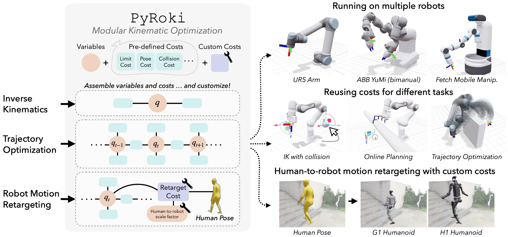

### 4.1 The Modular Paradigm (PyRoki Framework)

Advanced toolkits like PyRoki separate optimization variables (e.g., joint configurations $q$) from cost functions, creating reusable components that apply seamlessly to single-frame IK, sequential trajectory optimization, and motion retargeting.

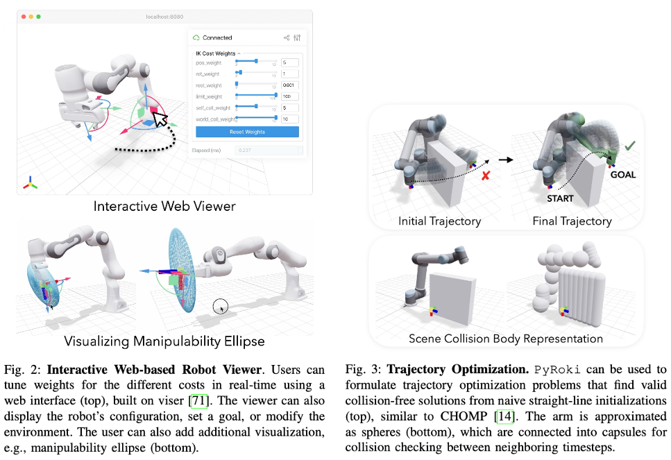

### 4.2 Hardware Acceleration and Massively Parallel Execution

A significant limitation of many physics-engine-based solvers is their reliance on sequential CPU execution. PyRoki is built on **JAX**, which provides several critical advantages for modern robotics research:

- **Just-In-Time (JIT) Compilation**: PyRoki compiles kinematic chains and cost functions into optimized machine code.

- **Hardware Agnosticism**: It executes seamlessly on **CPUs**, **GPUs**, and **TPUs**.

- **Vectorized Optimization**: While `mink` is optimized for a single robot's IK, PyRoki can optimize thousands of trajectories or retargeting sequences in parallel. This is indispensable for generating large-scale synthetic datasets for Reinforcement Learning (RL) or for real-time "model predictive" style kinematic planning where multiple candidate paths are evaluated simultaneously.

### 4.3 Modular Cost Abstraction and Differentiability

PyRoki’s architecture follows a "building block" approach that separates the robot model from the task requirements.

- **Composable Costs**: Users can mix and match pre-defined costs, such as `LimitCost`, `PoseCost`, `CollisionCost`, and `ManipulabilityCost`, or define custom semantic costs (e.g., "keep the camera upright while reaching").

- **Automatic Differentiation (Auto-Diff)**: Because it utilizes JAX, PyRoki computes **analytical, block-sparse Jacobians** for any arbitrary cost function automatically. In mink, adding a new, complex cost requires ensuring its gradient is compatible with the underlying MuJoCo/C solver. In PyRoki, as long as the cost is written in JAX-compatible Python, the gradient is handled by the framework.

    - **Joint Pose Cost**: Penalizes the deviation between the current and target base poses. Using the Lie group logarithm ensures geometric fidelity:

    ```math
    c_{pose}(\mathbf{q}, \mathbf{T}_{target}) = \frac{1}{2} \left\| \log\left(\mathbf{T}_{target}^{-1} \mathbf{T}_{i}(\mathbf{q})\right)^\vee \right\|_{\mathbf{W}}^2
    ```

    - **Manipulability Cost**: Maximizes Yoshikawa's manipulability measure to keep the robot away from singularities, utilizing the manipulator Jacobian $J_{i}(q)$:

    $$
    c_{manip}(\mathbf{q}, i) = \left( \sqrt{\det\left(\mathbf{J}_{i}(\mathbf{q})\mathbf{J}_{i}(\mathbf{q})^{\top}\right)} + \epsilon \right)^{-1}
    $$

    - **Collision Avoidance**: Signed distances $d$ between collision geometries (e.g., capsules/spheres) are computed and converted into costs. A smooth activation function avoids discontinuities at $d=0$:

    $$
    d_{c} = \begin{cases} 
    -d + 0.5\eta & \text{if } d < 0 \\ 
    \frac{0.5}{\eta}(-d + \eta)^{2} & \text{if } 0 < d < \eta \\ 
    0 & \text{otherwise} 
    \end{cases}
    $$

### 4.4 Global vs. Local Optimality

Differential IK (the core of `mink`) is inherently a local method; it is prone to local minima and "greedy" behavior that may lead to joint singularities or unavoidable collisions later in a motion.PyRoki enables **Trajectory Optimization**, which considers the entire time horizon $\mathbf{q}_{1:T}$ simultaneously. Mathematically, it solves:

$$
\min_{\mathbf{q}_{1:T}} \sum_{t=1}^T c_{task}(\mathbf{q}_t) + \sum_{t=1}^{T-1} c_{smooth}(\mathbf{q}_t, \mathbf{q}_{t+1})
$$

By optimizing the full path, PyRoki can "look ahead" to avoid future collisions or singularities that a local differential solver would fail to anticipate.

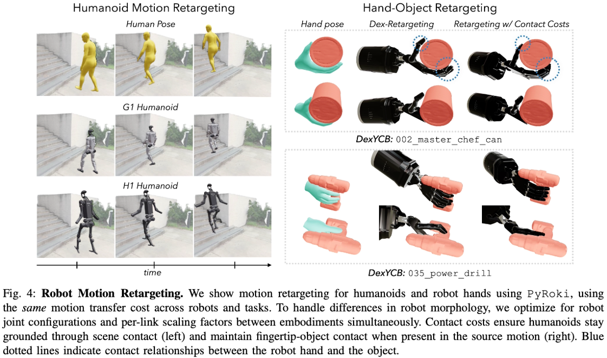

### Notes

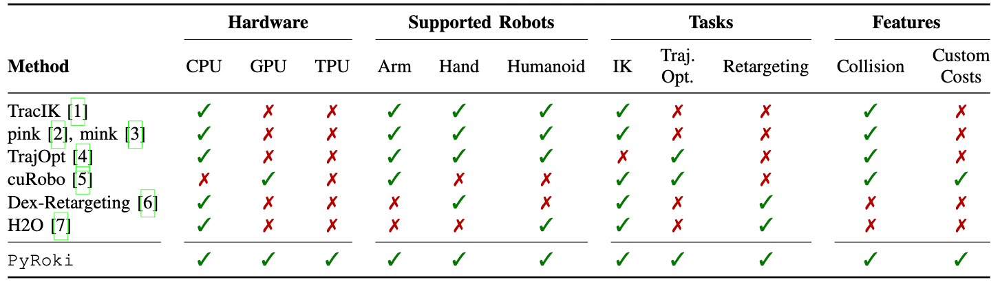

For applied impacts in humanoids:

- `mink` is ideal for the Real-Time Control Layer: Low-latency, reactive tracking of a user's hand gestures or high-frequency stabilization.

- `PyRoki` is ideal for the Planning and Synthesis Layer: Offline generation of high-fidelity reference motions for RL policies, or real-time complex "whole-body" maneuvers where the robot must balance multiple competing geometric constraints over a window of time.

In summary, `mink` is an excellent **engine** for local kinematic resolution, but `PyRoki` is a **complete toolkit** for designing, optimizing, and scaling complex humanoid behaviors across the modern AI hardware stack.

## 5: General Motion Retargeting (GMR)

- [Retargeting Matters: General Motion Retargeting for Humanoid Motion Tracking](https://arxiv.org/pdf/2510.02252)
    - Joao Pedro Araujo, Yanjie Ze, Pei Xu, Jiajun Wu, C. Karen Liu

The General Motion Retargeting (GMR) method represents a significant shift in the humanoid movement paradigm, moving from a philosophy of "fix it in training" to a philosophy of "rigorous geometric data preparation."

The power of GMR lies in its ability to decouple the quality of motion data from the complexity of reinforcement learning (RL) reward functions.

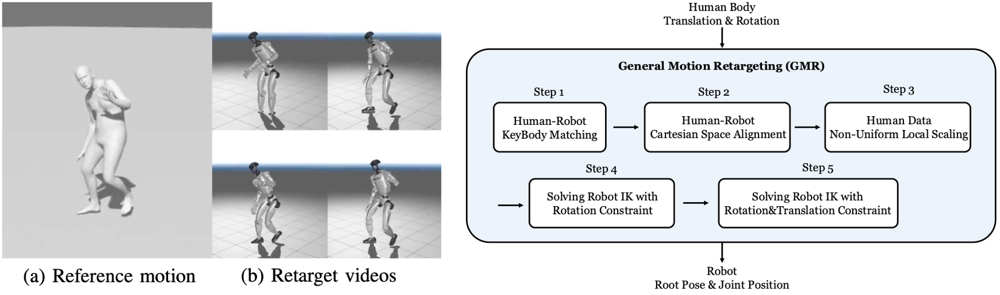

### 5.1 The "Data Quality over Reward Engineering" Insight

Historically, researchers used relatively "dirty" motion retargeting (containing foot sliding or self-collisions) and relied on complex RL reward functions and domain randomization to teach the robot to "ignore" these errors.

GMR demonstrates that high-fidelity retargeting is a primary determinant of policy success. By suppressing "extensive reward tuning," the GMR framework proves that if the reference trajectory is geometrically sound and physically feasible, the RL agent can learn robust locomotion with a much simpler, more intuitive reward structure. This emphasizes the importance of **kinematic integrity** in the early stages of the motion pipeline.

### 5.2 Non-Uniform Local Scaling (Morphology-Awareness)

Uniform scaling (resizing the entire skeleton by a single height ratio) is the most common source of retargeting artifacts. Because human and robot bone-length ratios differ (the embodiment gap), uniform scaling causes the robot’s feet to either hover above or penetrate the floor.

GMR introduces a **non-uniform local scaling** factor $s_{b}$ for each body link. This allows the system to preserve the spatial relationship between the robot’s end-effectors and the environment while respecting its specific mechanical proportions. The target Cartesian position for a body $b$ is formulated as:

```math
\mathbf{p}_{b}^{target} = \frac{h}{h_{ref}} s_{b} (\mathbf{p}_{j}^{source} - \mathbf{p}_{root}^{source}) + \frac{h}{h_{ref}} s_{root} \mathbf{p}_{root}^{source}
```

This explicit scaling ensures that critical contact events, like a foot hitting the ground, are preserved during the transfer process.

### 5.3 Two-Stage Differential IK Optimization

A single-pass Inverse Kinematics (IK) solver often gets stuck in local minima, especially when dealing with high-dimensional humanoids. GMR employs a robust two-stage optimization procedure:

- **Stage 1: Global Alignment.** The solver focuses on the highest-priority constraints: global root orientation and end-effector positions (hands and feet). This creates a geometrically stable "scaffold" for the motion.

- **Stage 2: Full-Body Fine-Tuning.** Using the first stage as an initial guess, the solver then optimizes all matching key bodies simultaneously.

This separation prevents the solver from collapsing into awkward, physically impossible joint configurations (singularities) that often plague standard one-pass retargeters.

### 5.4 Direct Integration with High-Performance Solvers

GMR is particularly powerful because it is designed to utilize modern, efficient backends like the mink package. By leveraging MuJoCo’s native collision detection and C-optimized hot paths, GMR can solve complex whole-body retargeting tasks with thousands of frames in a matter of seconds or even in real-time.

This highlights the synergy between **mathematical modeling** (non-uniform scaling) and **software realization** (mink/MuJoCo). The result is a system that can produce the massive, high-fidelity datasets required for training state-of-the-art embodied AI agents without the need for manual, frame-by-frame cleanup.

### Notes

In a research context, GMR provides a benchmark for evaluating other retargeting methods (like PHC or ProtoMotions). It proves that **retargeting matters**: a robot's ability to imitate a human is not just a function of the learning algorithm, but of the geometric mapping that bridges the two different physical worlds.

In applied scenarios, such as teleoperation or motion capture, GMR ensures that the robot’s movements appear natural and perceptually faithful to the human source while remaining strictly within the mechanical limits of the hardware. This makes it a foundational tool for developing interactive humanoid ecosystems where real-time fidelity is paramount.

## Concluding Remarks

To conclude this lecture on Humanoid Movement, we reflect on the transition from abstract mathematical structures to the high-fidelity realization of robotic motion. The journey from Micro Lie Theory to General Motion Retargeting (GMR) represents a shift in modern robotics: *we are moving away from "heuristic" motion and toward "geometrically principled" embodied AI*.

- **The Primacy of Geometry**: We have established that Lie groups ($SO(3)$ and $SE(3)$) are not merely mathematical abstractions but the essential language for singularity-free, robust robotics. By operating directly on the manifold, we ensure that our control updates—calculated in the Lie algebra—are always physically valid and numerically stable.

- **The Power of Modular Optimization**: Through the lens of PyRoki, we see that kinematic tasks are no longer siloed. Whether solving a single-frame IK problem or a thousand-frame trajectory, the underlying architecture of Variables + Costs remains consistent. The transition to JAX-based, hardware-accelerated solvers allows us to scale these computations to the demands of modern deep learning.

- **The "Retargeting Matters" Paradigm**: The GMR framework has taught us that the quality of our data is as important as the complexity of our learning algorithms. By solving the embodiment gap through non-uniform scaling and multi-stage optimization, we provide our RL agents with a "clean" foundation, significantly reducing the need for reward engineering and improving sim-to-real transfer.

- **Integration with Physics Engines**: Tools like mink demonstrate the necessity of tight integration between kinematic solvers and physics engines like MuJoCo. Real-time constraint enforcement—handling joint limits, self-collisions, and loop closures—is the final bridge that makes high-performance humanoid movement safe and deployable.

As we look toward the future of humanoid research and the expansion of interactive ecosystems, the role of the roboticist is evolving. We are no longer just building machines; we are designing **the mapping layers** that allow human intent to flow seamlessly into robotic embodiment.

The mathematical rigor, such as the ability to derive a Jacobian on a manifold or to define a morphology-aware scaling factor, is what enables a humanoid to move not just like a machine, but with the grace and intent of its human counterpart. As you move forward into your research and development, remember that **fidelity at the kinematic level is the prerequisite for intelligence at the behavioral level**.

    Master the geometry of the manifold, and you master the movement of the machine.
